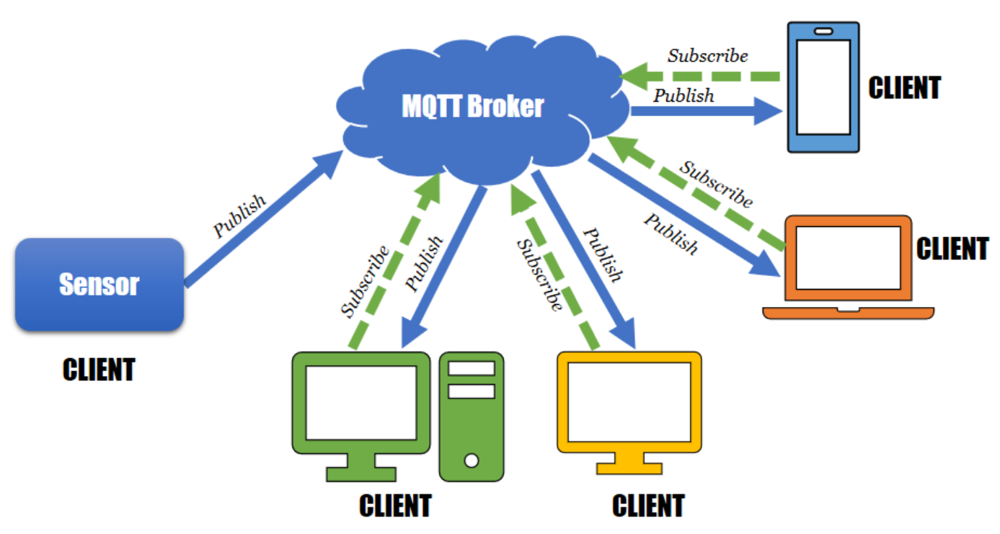

# Mosquitto MQTT broker

[Mosquitto](https://mosquitto.org) is an open source message broker that implements the MQTT protocol.

The MQTT protocol provides a lightweight method of carrying out messaging using a publish/subscribe model. This makes it suitable for Internet of Things messaging such as with low power sensors or mobile devices such as phones, embedded computers or microcontrollers.

<p align="center">

</p>

The Mosquitto MQTT broker is the central hub for messages. The the [Z-Wave to MQTT Gateway](./zwavejs2mqtt.md) and [Home Assistant](./ha_install.md) will connect to it.

See the mosquitto broker as a hub for messages without knowledge of the sender and topic, which publishes (broadcasts) the messages recieved. To do so, it uses a port the publisher and subscriber connect to. It is on the  publisher/subscriber to decide about the topic sent or recieved. 

## Installing Mosquitto with Docker

Note that the container will fail starting up as a default config file is missing. To fix this, just copy the [mosquitto.conf](https://github.com/eclipse/mosquitto/blob/master/mosquitto.conf) file from github to the `docker/mosquitto/config` directory and restart the container.

```
version: "3"
services:
  mosquitto:
    container_name: mosquitto
    image: eclipse-mosquitto
    restart: unless-stopped
    ports:
      - "1883:1883"
    volumes:
      - "/home/<your-user>l/docker/mosquitto/config:/mosquitto/config"
      - "/home/<your-user>/docker/mosquitto/data:/mosquitto/data"
      - "/home/<your-user>/docker/mosquitto/log:/mosquitto/log"
    environment:
      - TZ=Europe/Vienna
    user: "${LOCAL_USER}:${LOCAL_GROUP}"
```

Because we are only working on the local LAN, you can set the `listerer` in section _Extra listeners_ and the `allow_anonymous` in the _Security_ section config option to:

`vi docker/mosquitto/config/mosquitto.conf`

```
listener 1883 0.0.0.0
allow_anonymous true
```
