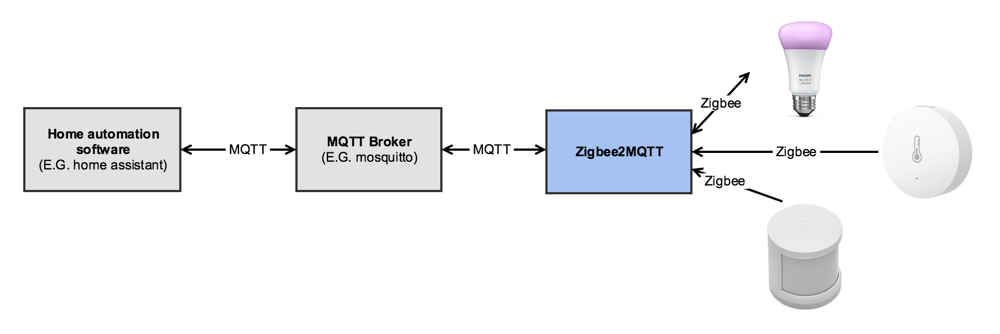

# Installing the Zigbee to MQTT Gateway

## Table of Contents

   * [Installing via Docker Compose](#installing-via-docker-compose)
      * [Fix MQTT Broker Connection Issues](#fix-mqtt-broker-connection-issues)
      * [Fix USB Device Error Issues](#fix-usb-device-error-issues)
   * [Update the Zigbee USB Gateway adapter](#update-the-zigbee-usb-gateway-adapter)
   * [Configuration](#configuration)

<!-- Created by https://github.com/ekalinin/github-markdown-toc -->

With the [Zigbee to MQTT](https://www.zigbee2mqtt.io) bridge, you can use your Zigbee devices without the vendor's bridge or gateway. It bridges events and allows you to control your Zigbee devices via MQTT. In this way you can integrate your Zigbee devices with whatever smart home infrastructure you are using.

<p align="center">

</p>

Note as MQTT is used, do not install in Home Assistant the Zigbee Home Automation (ZHA) or deCONZ / Phoscon extensions. Use MQTT instead.

## Installing via Docker Compose

Note that you **must** plugin the Zigbee USB Gateway adapter before configuring to avoid startup issues.

For the configuration, either use the [Sonoff Zigbee 3.0 USB Dongle Plus](https://www.amazon.de/gp/product/B09KXTCMSC/ref=ppx_yo_dt_b_asin_title_o01_s00?ie=UTF8&psc=1) (preferred) or the [Phoscon ConBee II - Universal Zigbee USB-Gateway](https://www.amazon.de/ConBee-das-universelle-Zigbee-USB-Gateway/dp/B07PZ7ZHG5/ref=sr_1_2?__mk_de_DE=ÅMÅŽÕÑ&crid=1WSYKN1A08TY1&keywords=Phoscon+ConBee+II+-+das+universelle+Zigbee+USB-Gateway&qid=1658563005&s=ce-de&sprefix=phoscon+conbee+ii+-+das+universelle+zigbee+usb-gateway%2Celectronics%2C188&sr=1-2) from _dresden electronik_.

For both devices a firmware upgrade is recommended before first use.
Note that as of December 2022, the Conbee II **does not** support `Install Codes` but the Sonoff does after a FW upgrade.

To get your `serial/by-id` value, connect the device run: `ls -l /dev/serial/by-id` and see the output.

Note that if you get `No such file or directory` but there is an output when using `by-path` instead of `by-id`, check with `dmesg -wH` if you get a response from connecting the device. If that works, you may have run into a [debian bug](https://bugs.debian.org/cgi-bin/bugreport.cgi?bug=1035094). To solve this issue, make a copy of the original file `/lib/udev/rules.d/60-serial.rules` and create a new one using the content of the solution referenced in the bug report. Finally reboot and `ls -l /dev/serial/by-id` should run fine.

Use the directory `/home/<your-user>/docker` as base for the volumes.

Note that [environment variables](https://www.zigbee2mqtt.io/guide/configuration/#environment-variables) are used to setup the connection to the MQTT broker (mosquitto) and necessary serial adapter config for the ConBee II. This eases basic startup configuration at the docker-compose level.

**IMPORTANT:** Currently you need to define the mqtt.server in the configuration.yaml file, the definition via an environment variable in the docker-compose file returns an error when starting up (MQTT failed to connect: Missing protocol)

Note that enironment variables overwrite settings in `configuration.yaml`.\
To edit the [configuration](https://www.zigbee2mqtt.io/guide/configuration/#configuration) file post first start, type: 
`sudo vi ~/docker/zigbee2mqtt/data/configuration.yaml`

```
version: '3.8'
services:
  zigbee2mqtt:
    container_name: zigbee2mqtt
    image: koenkk/zigbee2mqtt:latest
    restart: always
    logging:
      driver: "json-file"
      options:
        max-size: "200k"
        max-file: "10"
    volumes:
      - /home/mmattel/docker/zigbee2mqtt/data:/app/data
      - /run/udev:/run/udev:ro
    ports:
      # Frontend port
      - 8090:8080
    environment:
      - TZ=Europe/Vienna
      - ZIGBEE2MQTT_CONFIG_MQTT_SERVER=mqtt://<you-server>:1883
      - ZIGBEE2MQTT_CONFIG_MQTT_USER=<your-user>
      - ZIGBEE2MQTT_CONFIG_MQTT_PASSWORD=<your-pwd>
      - ZIGBEE2MQTT_CONFIG_SERIAL_PORT=/dev/zigbee
      #- ZIGBEE2MQTT_CONFIG_SERIAL_ADAPTER=deconz
      - ZIGBEE2MQTT_CONFIG_FRONTEND=true 
    devices:
      # Do not use /dev/ttyUSBX serial devices, as those mappings can change over time.
      # Instead, use the /dev/serial/by-id/X serial device for your Zigbee stick like
      #- "/dev/serial/by-id/usb-dresden_elektronik_ingenieurtechnik_GmbH_ConBee_II_DE2598287-if00:/dev/ttyACM0"
      #- "/dev/serial/by-id/usb-dresden_elektronik_ingenieurtechnik_GmbH_ConBee_II_DE2598287-if00:/dev/zigbee"
      - "/dev/serial/by-id/usb-Silicon_Labs_Sonoff_Zigbee_3.0_USB_Dongle_Plus_0001-if00-port0:/dev/zigbee"
    group_add:
      - dialout
    user: "${LOCAL_USER}:${LOCAL_GROUP}"
```

When you have started the container, it will most likely fail for some reasons:

- The connection to the MQTT broker (mosquitto) fails.
- When using the Conbee II, the `adapter: deconz` setting is not set.
- The `serial/by-id` string is incorrect. 
- You have not connected the Zigbee USB Gateway adapter.

See the log responses in `Dozzle` for details.

If the Zigbee USB Gateway adapter is not connected or misconfigured, you will see log messages like: `Error: Error while opening serialport 'Error: Error: No such file or directory, cannot open /dev/ttyACM0'` 

When the container is running, you can access Zigbee2MQTT via `https://<your-server/ip>:8090`.

### Fix MQTT Broker Connection Issues

- Check the environmant variables in the docker-compose file.
- Use the FQDN, the server may not be accessible using the hostname only.

### Fix USB Device Error Issues

- Connect the Zigbee USB Gateway adapter
- When using the Conbee II, check if you have _added_ `adapter: deconz`, see the [configuration](https://www.zigbee2mqtt.io/guide/adapters/#other) section of the documentation.
- Check the `serial/by-id` value with `ls -l /dev/serial/by-id` and add it to the docker-compose file.
- Check the [Zigbee2MQTT fails to start](https://www.zigbee2mqtt.io/guide/installation/20_zigbee2mqtt-fails-to-start.html#zigbee2mqtt-fails-to-start) section.
- When all checked, restart the container.

## Update the Zigbee USB Gateway adapter

Note to stop all containers accessing the adapter. Power off/on the adapter post successful flashing and restart the containers accessing it.
  
* Use the bash/python [firmware_sonoff.sh](../scripts/firmware_sonoff.sh) script to flash the adapter. Change the FW date in the script according your needs, the rest is done by the script.
* When using  ConBee II, you need to use the GCFFlasher tool. A description and the tool can be found here: [Firmware in Windows](https://github.com/dresden-elektronik/deconz-rest-plugin/wiki/Update-deCONZ-manually#update-in-windows) . To use [GCFFlasher](https://github.com/dresden-elektronik/gcfflasher) on Linux, you must compile it by yourself. Download the [firmware](https://deconz.dresden-elektronik.de/deconz-firmware/?C=M;O=D) and see the [Firmware Changelog](https://github.com/dresden-elektronik/deconz-rest-plugin/wiki/Firmware-Changelog) for changes.

## Configuration

See the [Configuration](https://www.zigbee2mqtt.io/guide/configuration/#configuration) documentation for more details.
